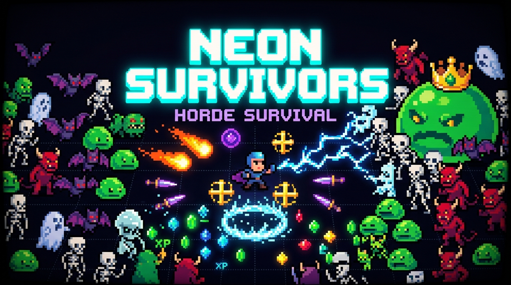
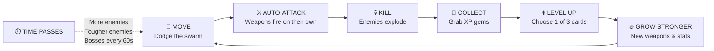
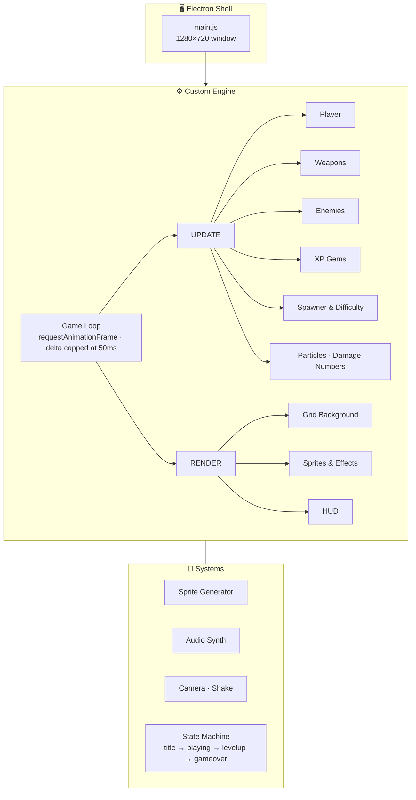

<div align="center">



# ⚡ N E O N &nbsp; S U R V I V O R S ⚡

### *One hero. One void. Infinite hordes.*

**A retro pixel-art horde-survival roguelite — crafted solo by [SIDR_EXE](#-the-developer)**

<br>

[](../../releases/latest)
&nbsp;
[](../../releases/latest)
&nbsp;
[](#-the-game)

[](../../releases/latest)
[](#-under-the-hood)
[](#-under-the-hood)
[](#-sound-design)
[](#-the-developer)

<br>

```
 ▄▄▄▄▄▄▄▄▄▄▄▄▄▄▄▄▄▄▄▄▄▄▄▄▄▄▄▄▄▄▄▄▄▄▄▄▄▄▄▄▄▄▄▄▄▄▄▄▄▄▄▄▄▄▄
 █  PRESS ENTER TO BEGIN  ·  WEAPONS FIRE AUTOMATICALLY █
 ▀▀▀▀▀▀▀▀▀▀▀▀▀▀▀▀▀▀▀▀▀▀▀▀▀▀▀▀▀▀▀▀▀▀▀▀▀▀▀▀▀▀▀▀▀▀▀▀▀▀▀▀▀▀▀
```

</div>

---

## 📜 Table of Contents

<table>
<tr>
<td>

- [🌌 The Game](#-the-game)
- [⬇️ Download & Install](#️-download--install)
- [🎮 Controls](#-controls)
- [🔁 The Core Loop](#-the-core-loop)
- [⚔️ The Arsenal](#️-the-arsenal)
- [👹 The Bestiary](#-the-bestiary)

</td>
<td>

- [👑 The Boss](#-the-boss-mega-slime)
- [💎 Progression & Upgrades](#-progression--upgrades)
- [📈 The Difficulty Curve](#-the-difficulty-curve)
- [🎨 Art Direction](#-art-direction)
- [🔊 Sound Design](#-sound-design)
- [🧠 Under the Hood](#-under-the-hood)

</td>
<td>

- [🏆 Survival Tips](#-survival-tips)
- [🗺️ Roadmap](#️-roadmap)
- [🛠️ Build From Source](#️-build-from-source)
- [❓ FAQ](#-faq)
- [👤 The Developer](#-the-developer)
- [📄 License](#-license)

</td>
</tr>
</table>

---

## 🌌 The Game

> *There is no map. There is no exit. There is only the dark grid beneath your boots — and the sound of something slithering toward you from every direction at once.*

**Neon Survivors** drops you into an endless void as a lone caped warrior. You don't aim. You don't swing. Your weapons fire **on their own** — your only job is to **move, dodge, and decide**.

Every monster you destroy bleeds glowing **XP gems**. Every level-up offers **three cards** — a new spell, a deadlier version of one you own, or a boost to your body. Stack them right and you become a walking storm of fire, lightning, and holy light. Stack them wrong and the horde swallows you whole.

The clock never stops. The swarm never stops. **How long can you last?**

<div align="center">

| 🎯 **Genre** | 🕹️ **Mode** | ⏱️ **Session** | 🧩 **Replayability** |
|:---:|:---:|:---:|:---:|
| Horde Survival / Roguelite | Single-player, endless | 5 – 20+ min runs | Randomized upgrade draws every level |

</div>

---

## ⬇️ Download & Install

<div align="center">

### 👉 [**GET THE LATEST RELEASE**](../../releases/latest) 👈

</div>

Two ways to play — pick your poison:

| Package | Size | Best for |
|---|:---:|---|
| 💿 **`Neon Survivors Setup 1.0.0.exe`** | ~95 MB | Standard install — Desktop shortcut, Start Menu entry, uninstaller |
| 📦 **`win-unpacked.zip`** | ~137 MB | Portable — unzip anywhere, run `Neon Survivors.exe`, no install needed |

### 💿 Installer

1. Download **`Neon Survivors Setup 1.0.0.exe`** from [Releases](../../releases/latest)
2. Run it — the game installs and drops a shortcut on your Desktop
3. Launch **Neon Survivors** and press **ENTER**

### 📦 Portable

1. Download **`win-unpacked.zip`** from [Releases](../../releases/latest)
2. Extract it to any folder (USB stick works too)
3. Double-click **`Neon Survivors.exe`**

> [!NOTE]
> **Windows SmartScreen** may show *"Windows protected your PC"* because this is an indie build without a paid code-signing certificate. Click **More info → Run anyway**. The game is safe — it doesn't touch the network beyond loading its font, and it saves nothing to your disk.

### 🖥️ System Requirements

| | Minimum | Recommended |
|---|---|---|
| **OS** | Windows 10 (64-bit) | Windows 11 (64-bit) |
| **CPU** | Any dual-core | Quad-core |
| **RAM** | 4 GB | 8 GB |
| **GPU** | Any DirectX 11 / integrated graphics | Any dedicated GPU |
| **Storage** | 250 MB | 250 MB |
| **Input** | Keyboard | Keyboard + mouse |

---

## 🎮 Controls

<div align="center">

| Key | Action |
|:---:|---|
| <kbd>W</kbd> <kbd>A</kbd> <kbd>S</kbd> <kbd>D</kbd> | Move |
| <kbd>↑</kbd> <kbd>←</kbd> <kbd>↓</kbd> <kbd>→</kbd> | Move (alternate) |
| <kbd>1</kbd> <kbd>2</kbd> <kbd>3</kbd> | Pick an upgrade card on level-up (numpad works too) |
| 🖱️ **Click** | Pick an upgrade card on level-up |
| <kbd>Enter</kbd> | Start game / Retry after death |

**That's it.** Weapons fire automatically. Your skill is in your feet.

</div>

> [!TIP]
> **Directional weapons follow your movement.** Fire Wave and Shadow Daggers shoot the way you're walking — but **stand still** and they'll auto-lock onto the **nearest enemy** instead.

---

## 🔁 The Core Loop



You start each run with **5 hearts** and a single weapon — **🔥 Fire Wave**. Everything else is earned.

---

## ⚔️ The Arsenal

Six weapons. Each one changes how you play. Every weapon levels up independently and **gains extra projectiles, pierce, or targets** as it grows.

<table>
<tr>
<th width="20%">Weapon</th>
<th width="12%">Type</th>
<th width="13%">Base DMG</th>
<th width="55%">Behavior & Scaling</th>
</tr>

<tr>
<td align="center"><h3>🔥</h3><b>Fire Wave</b><br><sub><i>Starter weapon</i></sub></td>
<td>Projectile</td>
<td align="center"><b>16</b><br><sub>every 0.7s</sub></td>
<td>Hurls blazing fireballs in your movement direction. Gains <b>+1 fireball every 3 levels</b> (fanning out up to <b>5</b>) and <b>pierces</b> through more enemies as it levels.</td>
</tr>

<tr>
<td align="center"><h3>🗡</h3><b>Shadow Daggers</b></td>
<td>Projectile</td>
<td align="center"><b>9</b><br><sub>every 0.35s</sub></td>
<td>The fastest weapon in the game. A relentless stream of violet blades at 420 px/s. Scales up to <b>4 daggers per volley</b>, each piercing <b>multiple enemies</b>.</td>
</tr>

<tr>
<td align="center"><h3>⚡</h3><b>Lightning</b></td>
<td>Auto-target</td>
<td align="center"><b>28</b><br><sub>every 1.5s</sub></td>
<td>Heaviest single hit. Calls jagged bolts down on <b>random enemies within 220 px</b>. Chains up to <b>3 targets</b> per strike at higher levels. Shakes the screen on every hit.</td>
</tr>

<tr>
<td align="center"><h3>❄</h3><b>Frost Nova</b></td>
<td>Area / Control</td>
<td align="center"><b>10</b><br><sub>every 3.0s</sub></td>
<td>An expanding ice ring that hits everything nearby and <b>slows enemies by 60% for 2 seconds</b>. Radius grows <b>+15 px per level</b>. Your panic button.</td>
</tr>

<tr>
<td align="center"><h3>✝</h3><b>Holy Cross</b></td>
<td>Orbital</td>
<td align="center"><b>12</b><br><sub>per contact</sub></td>
<td>Golden crosses that spin around you in a tight 75 px orbit, grinding through anything that gets close. Grows to <b>4 crosses</b>.</td>
</tr>

<tr>
<td align="center"><h3>🔮</h3><b>Arcane Orbs</b></td>
<td>Orbital</td>
<td align="center"><b>8</b><br><sub>per contact</sub></td>
<td>Glowing violet orbs on a wide 110 px orbit — a rotating shield against the outer ring of the swarm. Starts with <b>2 orbs</b>, scales to <b>6</b>.</td>
</tr>
</table>

> [!IMPORTANT]
> **Every hit has a 10% chance to CRIT for double damage** — shown as big golden numbers with a screen-shake kick. Cooldown-based weapons also fire **15% faster with every level**, so they compound hard.

---

## 👹 The Bestiary

The void releases new horrors as the clock ticks. Here's who's coming for you — and **when**.

<table>
<tr>
<th>Creature</th>
<th>Arrives</th>
<th>HP</th>
<th>Speed</th>
<th>Contact DMG</th>
<th>Drops</th>
<th>Field Notes</th>
</tr>
<tr>
<td>🟢 <b>Slime</b></td>
<td align="center"><code>00:00</code></td>
<td align="center">10</td>
<td align="center">🐢 Slow</td>
<td align="center">❤️</td>
<td>💚 Small gem</td>
<td>Squishy, wobbly, everywhere. The fodder that becomes a flood.</td>
</tr>
<tr>
<td>🦇 <b>Bat</b></td>
<td align="center"><code>01:00</code></td>
<td align="center">6</td>
<td align="center">⚡ <b>Very fast</b></td>
<td align="center">❤️</td>
<td>💚 Small gem</td>
<td>Fragile, but more than twice as fast as a slime. Red eyes, white fangs, flapping wings.</td>
</tr>
<tr>
<td>💀 <b>Skeleton</b></td>
<td align="center"><code>03:00</code></td>
<td align="center">22</td>
<td align="center">🚶 Medium</td>
<td align="center">❤️</td>
<td>💙 Medium gem</td>
<td>Bone-tough. Red pinpoint eyes in black sockets. Soaks up early-game damage.</td>
</tr>
<tr>
<td>👻 <b>Ghost</b></td>
<td align="center"><code>05:00</code></td>
<td align="center">16</td>
<td align="center">🚶 Medium</td>
<td align="center">❤️</td>
<td>💙 Medium gem</td>
<td>Flickers in and out of sight, bobbing as it drifts. Hard to track in a crowd.</td>
</tr>
<tr>
<td>😈 <b>Demon</b></td>
<td align="center"><code>08:00</code></td>
<td align="center"><b>55</b></td>
<td align="center">🐢 Slow</td>
<td align="center">❤️❤️</td>
<td>💛 Large gem</td>
<td>Horned tank. Hits for <b>double damage</b>. If one reaches you, you'll feel it.</td>
</tr>
</table>

> [!WARNING]
> **Enemies grow stronger over time.** Every minute, all newly spawned enemies gain **+15% HP** and move **+3% faster** (capped at 2× base speed). A slime at minute 10 is not the slime from minute 1.

---

## 👑 The Boss: Mega Slime

<div align="center">

```
         ▲   ▀▀   ▲
      ▄▄████████████▄▄
    ▄██  ▓▓▓    ▓▓▓  ██▄
   ███   ▓●▓    ▓●▓   ███
  ██████████████████████████
   ████  ▒▒      ▒▒   ████
     ▀██████████████████▀
          ⚠  WARNING  ⚠
         BOSS  INCOMING
```

</div>

Every **60 seconds**, the screen shakes, a low sawtooth growl rumbles, and a red warning flashes across the void:

> ### ⚠ WARNING: BOSS INCOMING ⚠

The **Mega Slime** — a crowned, red-eyed king of the goo — enters the arena.

| Stat | Value |
|---|---|
| **Base HP** | 250 *(+50% per boss wave, plus time scaling)* |
| **Contact Damage** | ❤️❤️ |
| **Health Bar** | Floating above its head — turns 🟢 → 🟠 → 🔴 |
| **Reward** | ❤️‍🔥 **Huge red gem worth 25 XP** |
| **On Death** | 💥 **Splits into 5 slimes** |

**It doesn't stay one boss.** Wave 1 sends one. Wave 2 sends **two**. Wave 3 and beyond send **three at once** — each tougher than the last.

---

## 💎 Progression & Upgrades

### XP Gems

| Gem | Color | XP | Dropped by |
|:---:|:---:|:---:|---|
| ◆ Small | 🟢 Green | 1 | Slimes, Bats |
| ◆ Medium | 🔵 Blue | 2 | Skeletons, Ghosts |
| ◆ Large | 🟡 Gold | 4 | Demons |
| ◆ Huge | 🔴 Red | **25** | Mega Slime |

Gems pop out of fallen enemies, bob on the floor, and **get pulled toward you** once you're inside your magnet radius.

### Level-Up Cards

Each level-up pauses the action and deals **three cards**. If there's a weapon you don't own yet, **at least one card is guaranteed to be a new weapon**.

| Card | Icon | Effect |
|---|:---:|---|
| **NEW: [Weapon]** | 🔥🗡⚡❄✝🔮 | Adds a new weapon to your arsenal |
| **[Weapon] DMG+** | — | That weapon deals **+25% damage** and gains a level |
| **[Weapon] SPD+** | — | **+20% attack speed** and gains a level |
| **Swift Boots** | 👢 | Movement speed **+12%** |
| **Vitality** | 💖 | Max HP **+1** (and heals 1) |
| **Recovery** | 💚 | Heal **1 HP** |
| **Magnet** | 🧲 | Gem pickup range **+35%** |

> [!TIP]
> Every weapon level counts — whether you took DMG+ or SPD+, the weapon still gains its **extra projectiles, pierce, orbit count, and cooldown reduction**.

---

## 📈 The Difficulty Curve

Neon Survivors doesn't use fixed waves. It uses a **continuous pressure engine** that tightens every second you survive.

| System | Formula | What it feels like |
|---|---|---|
| **Spawn rate** | `1.2s × 0.92^minutes`, floor `0.15s` | Starts gentle. By late game, enemies pour in ~7× per second |
| **Group size** | `2 + seconds ÷ 30` | 2 enemies per spawn at the start → 22 per spawn at 10:00 |
| **Enemy HP** | `+15%` per minute | Your early damage stops being enough |
| **Enemy speed** | `+3%` per minute (max 2×) | The gaps you dodge through start closing |
| **Bosses** | Every 60s, up to 3 at once | Constant spikes of panic |
| **XP needed** | `8 + level × 5` | Each level takes a bit more grinding |

```
DANGER ▲
       │                                              ████
       │                                       ███████████
       │                                ██████████████████  😈 Demons
       │                         ███████████████████████████
       │                  ██████████████████████████████████  👻 Ghosts
       │           █████████████████████████████████████████  💀 Skeletons
       │     ███████████████████████████████████████████████  🦇 Bats
       │ ███████████████████████████████████████████████████  🟢 Slimes
       └──────┬──────┬──────┬──────┬──────┬──────┬──────┬────▶ TIME
            01:00  02:00  03:00  04:00  05:00  06:00  08:00
              👑     👑     👑     👑     👑     👑     👑    ← boss every minute
```

---

## 🎨 Art Direction

> *Small sprites. Big glow. Deep dark.*

- **🎨 PICO-8 inspired 16-color palette** — the classic fantasy-console colors (`#FF004D` red, `#29ADFF` blue, `#00E436` green, `#FFEC27` yellow, `#7E2553` purple…)
- **🌑 The Void** — a near-black `#0f0e17` arena with a dotted grid and faint larger gridlines that scroll as you move, so you always feel the endless space
- **🧱 Hand-placed pixel sprites** — every character is drawn rectangle by rectangle in code at **3× pixel scale**. The hero is a 10×14 grid; the Mega Slime is 16×14
- **📺 CRT overlay** — real scanlines plus a vignette darkening the screen edges for that old-monitor feel
- **✨ Neon glow** — fireballs, orbs, crosses, gems and lightning all carry soft light halos
- **🔠 Typography** — [*Press Start 2P*](https://fonts.google.com/specimen/Press+Start+2P), the definitive arcade font

### Game Feel ("Juice")

| Effect | Where |
|---|---|
| 📳 **Screen shake** | Getting hit, crits, lightning, frost novas, boss arrivals, boss kills, death |
| ⏸️ **Hit-stop** | A micro-freeze on every hit so impacts feel *heavy* |
| 💥 **Particle bursts** | Every hit, every kill, every gem pickup, every projectile trail |
| 🔢 **Floating damage numbers** | White for normal, **big gold for crits** |
| ⚪ **Hit flash** | Enemies flash bright white when struck |
| 🔵 **Frost tint** | Slowed enemies glow with a cold blue aura |
| 🫧 **Living sprites** | Slimes squish, bats flap, ghosts flicker and bob, the hero walks with a 2-frame cycle |
| 💗 **I-frames** | After a hit, the hero blinks and is invincible for 1.2 seconds |
| 🌠 **Title particles** | Colored pixels drift up the menu screen like embers |

---

## 🔊 Sound Design

**There isn't a single audio file in this game.**

Every sound effect is **synthesized in real time** with the Web Audio API — raw oscillators (square, sawtooth, sine, triangle) shaped with pitch drops and volume envelopes. It's pure 8-bit chiptune, generated on the spot.

| Event | Waveform | Character |
|---|---|---|
| 🔥 Fireball | Sawtooth | Rough *whoosh* |
| 🗡 Dagger | Triangle | Sharp *flick* |
| ⚡ Lightning | Square + Sine | High *crack* with a tail |
| ❄ Frost Nova | Sine | Soft cold *pulse* |
| ✝ Holy Cross | Sine | Faint *chime* |
| 👊 Enemy hit | Square | Crunchy *tick* |
| 💀 Enemy kill | Square ×2 | Rising *pop-pop* |
| 💎 Gem pickup | Sine ×2 | Bright *blip-bloop* |
| ⬆️ Level up | Square ×4 | Classic ascending **arpeggio** 🎵 |
| 💔 Player hurt | Sawtooth | Low *buzz* |
| 👑 Boss arrival | Sawtooth ×2 | Deep, ominous *rumble* |

---

## 🧠 Under the Hood

Neon Survivors runs on a **custom-built engine** — no Unity, no Godot, no Phaser, no game libraries.

<div align="center">

| | |
|---|---|
| 🧩 **Engine** | Custom, built from scratch on **HTML5 Canvas 2D** |
| 💻 **Language** | Vanilla **JavaScript** |
| 🖼️ **Graphics** | 100% procedural — sprites generated in code at startup |
| 🔊 **Audio** | 100% procedural — Web Audio API synthesis |
| 📦 **Desktop shell** | **Electron 43** |
| 🏗️ **Packaging** | **electron-builder 26** → NSIS Windows installer |
| 📄 **Game code** | **One self-contained file** (~2,200 lines) |
| 🖼️ **Image files** | **0** |
| 🎵 **Audio files** | **0** |

</div>

### Engine Architecture



### Technical Highlights

- **⏱️ Frame-rate independent** — all motion is delta-time based with a 50 ms cap, so the game behaves the same at 60 Hz or 144 Hz and never "teleports" after a lag spike
- **🎥 Smooth follow camera** — eases toward the player each frame, with decaying screen shake on top
- **🎯 Per-enemy hit cooldowns** — orbital weapons track each enemy so they hit consistently instead of every frame
- **🧹 Performance guards** — particles are capped at 600, off-screen objects aren't drawn, and far-away enemies and gems are cleaned up automatically
- **🖼️ Pixel-perfect rendering** — `image-rendering: pixelated` and image smoothing disabled keep every pixel crisp
- **📐 Fair diagonals** — diagonal movement is normalized so you're never faster going sideways
- **🔒 Secure shell** — Electron runs with context isolation on and Node integration off

---

## 🏆 Survival Tips

> *Wisdom from the void.*

1. **🌀 Never stop moving.** Kite enemies in wide circles. Standing still is how you get surrounded.
2. **🎯 But stopping has a use.** Stand still for a moment and your projectiles **auto-aim at the nearest enemy** — handy when a demon is closing in.
3. **❄ Take Frost Nova early.** Slowing a whole crowd by 60% is the best panic button in the game.
4. **🔮 Orbitals + projectiles = coverage.** Orbitals guard you up close, projectiles thin the crowd at range. Get both.
5. **🧲 Don't skip Magnet.** More pickup range means faster levels without diving into the swarm.
6. **💖 Vitality > Recovery.** A permanent extra heart is usually worth more than a one-time heal.
7. **👑 Bosses split.** When a Mega Slime dies, 5 slimes burst out. Don't stand on top of it.
8. **😈 Respect the demons.** They hit for 2 hearts. Clear them first after 08:00.

---

## 🗺️ Roadmap

Neon Survivors **v1.0** is complete and playable. Ideas being explored for future updates:

- [x] 6 unique weapons with independent leveling
- [x] 5 enemy types + scaling Mega Slime boss
- [x] Procedural pixel art & synthesized chiptune audio
- [x] Windows installer + portable build
- [ ] 🎵 Background music track
- [ ] 💾 Local high-score leaderboard
- [ ] 🧬 Weapon evolutions (combine max-level weapons)
- [ ] 🦸 Multiple playable characters with unique starting weapons
- [ ] 👹 New bosses beyond the Mega Slime
- [ ] 🎮 Gamepad support
- [ ] ⏸️ Pause menu & settings (volume, screen shake toggle)
- [ ] 🐧 macOS & Linux builds

*Have an idea? [Open an issue](../../issues) — feedback shapes the game.*

---

## 🛠️ Build From Source

Only needed if you have the source code and want to build it yourself.

**Requirements:** [Node.js](https://nodejs.org/) 18+

```bash
# 1. Install dependencies (Electron + electron-builder)
npm install

# 2. Play in dev mode
npm start

# 3. Build an unpacked folder (dist/win-unpacked/)
npm run pack

# 4. Build the full Windows installer (dist/Neon Survivors Setup 1.0.0.exe)
npm run build
```

> [!TIP]
> Want to try it instantly? Just open `index.html` in any modern browser — the whole game runs there with no install.

---

## ❓ FAQ

<details>
<summary><b>Is it free?</b></summary>
<br>
Yes. Download it from <a href="../../releases/latest">Releases</a> and play.
</details>

<details>
<summary><b>Windows says "Windows protected your PC" — is it a virus?</b></summary>
<br>
No. That's SmartScreen warning about an app from an unsigned indie developer (code-signing certificates cost money). Click <b>More info → Run anyway</b>.
</details>

<details>
<summary><b>Why is the installer ~95 MB for such a small game?</b></summary>
<br>
The game itself is tiny (the packed game file is about 76 KB). Most of the size is <b>Electron</b>, a built-in Chromium runtime that makes the game run the same on every Windows PC, with no browser or extra software needed.
</details>

<details>
<summary><b>Does it save my progress?</b></summary>
<br>
Not yet — every run is a fresh start, roguelite style. A local high-score board is on the <a href="#️-roadmap">roadmap</a>.
</details>

<details>
<summary><b>Does it need internet?</b></summary>
<br>
No. The game is fully offline. The only network request is for the <i>Press Start 2P</i> font; without internet it falls back to a system monospace font and everything else works the same.
</details>

<details>
<summary><b>Can I use a controller?</b></summary>
<br>
Keyboard only for now. Gamepad support is on the <a href="#️-roadmap">roadmap</a>.
</details>

<details>
<summary><b>What's the longest anyone has survived?</b></summary>
<br>
Post your best <b>time</b>, <b>kills</b>, and <b>level</b> in <a href="../../issues">Issues</a> or Discussions. Bragging rights are earned in the void. 💀
</details>

---

## 👤 The Developer

<div align="center">

```
███████╗██╗██████╗ ██████╗         ███████╗██╗  ██╗███████╗
██╔════╝██║██╔══██╗██╔══██╗        ██╔════╝╚██╗██╔╝██╔════╝
███████╗██║██║  ██║██████╔╝        █████╗   ╚███╔╝ █████╗  
╚════██║██║██║  ██║██╔══██╗        ██╔══╝   ██╔██╗ ██╔══╝  
███████║██║██████╔╝██║  ██║███████╗███████╗██╔╝ ██╗███████╗
╚══════╝╚═╝╚═════╝ ╚═╝  ╚═╝╚══════╝╚══════╝╚═╝  ╚═╝╚══════╝
```

### **SIDR_EXE**
*Solo Indie Developer*

</div>

**Neon Survivors** was designed, programmed, drawn, and sound-designed by **one person**.

| Role | Who |
|---|---|
| 🎮 Game Design | SIDR_EXE |
| 💻 Programming & Engine | SIDR_EXE |
| 🎨 Pixel Art | SIDR_EXE |
| 🔊 Sound Design | SIDR_EXE |
| 📦 Build & Release | SIDR_EXE |
| ☕ Fuel | Way too much caffeine |

No studio. No team. No publisher. Just code, pixels, and a lot of late nights.

> *"Every slime, every spark, every beep — built one line at a time."*
> — **SIDR_EXE**

### 💬 Support the Project

If you enjoyed surviving the void:

- ⭐ **Star this repo** — it really helps indie devs get noticed
- 🐛 **[Report bugs](../../issues)** — help make the next version better
- 💡 **[Suggest features](../../issues)** — shape what comes next
- 📢 **Share it** — tell a friend who likes roguelites

---

## 🙏 Acknowledgements

- **[Vampire Survivors](https://poncle.itch.io/vampire-survivors)** by poncle — for inventing the genre that inspired this game
- **[PICO-8](https://www.lexaloffle.com/pico-8.php)** by Lexaloffle — for the iconic 16-color palette
- **[Press Start 2P](https://fonts.google.com/specimen/Press+Start+2P)** by CodeMan38 — for the arcade font
- **[Electron](https://www.electronjs.org/)** & **[electron-builder](https://www.electron.build/)** — for turning a canvas into a desktop game

---

## 📄 License

© 2026 **SIDR_EXE**. All rights reserved.

Neon Survivors is free to download and play. The game, its code, art, and audio may not be redistributed, resold, or re-uploaded without permission from the developer.

---

<div align="center">

```
╔══════════════════════════════════════════════╗
║                                              ║
║            ☠   G A M E   O V E R   ☠         ║
║                                              ║
║       TIME SURVIVED ........ ??:??           ║
║       ENEMIES KILLED ....... ????            ║
║       BOSSES SLAIN ......... ?               ║
║                                              ║
║            PRESS ENTER TO RETRY              ║
║                                              ║
╚══════════════════════════════════════════════╝
```

### **[⬇ DOWNLOAD NOW AND FIND OUT ⬇](../../releases/latest)**

<sub>Made with 💜 and way too many slimes by <b>SIDR_EXE</b></sub>

</div>
